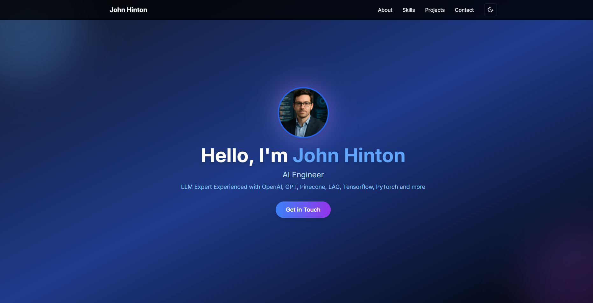

# John Hinton - AI Engineer Portfolio

A modern, responsive portfolio website built with Next.js, showcasing expertise in AI Engineering and Large Language Models.



## 🌟 Features

- **Modern Design**: Clean and professional UI with smooth animations
- **Dark/Light Mode**: Toggle between dark and light themes
- **Responsive**: Fully responsive design that works on all devices
- **Interactive Elements**: Smooth animations and transitions using Framer Motion
- **Contact Form**: Easy way for potential clients to get in touch
- **Project Showcase**: Highlighting key AI and LLM projects

## 🛠️ Technologies Used

- **Frontend Framework**: Next.js 13+
- **Styling**: Tailwind CSS
- **Animations**: Framer Motion
- **Language**: TypeScript
- **Deployment**: Vercel (recommended)

## 🚀 Getting Started

### Prerequisites

- Node.js 16.8 or later
- npm or yarn package manager

### Installation

1. Clone the repository:
```bash
git clone https://github.com/prodev1119/portfolio
cd portfolio
```

2. Install dependencies:
```bash
npm install
# or
yarn install
```

3. Run the development server:
```bash
npm run dev
# or
yarn dev
```

4. Open [http://localhost:3000](http://localhost:3000) in your browser to see the result.

## 📁 Project Structure

```
portfolio/
├── src/
│   ├── app/
│   │   ├── page.tsx        # Main page component
│   │   └── layout.tsx      # Root layout
│   ├── components/
│   │   ├── navbar.tsx      # Navigation component
│   │   ├── mode-toggle.tsx # Theme toggle component
│   │   └── AnimatedImage.tsx # Image animation component
│   └── styles/
├── public/
│   ├── john-main.jpg      # Profile image
│   ├── pro-1.jpg          # Project images
│   └── pro-2.jpg
└── package.json
```

## 🎨 Customization

1. **Profile Information**: Update your personal information in `src/app/page.tsx`
2. **Projects**: Modify the projects section in the main page component
3. **Styling**: Customize the theme colors in your Tailwind configuration
4. **Images**: Replace the images in the `public` directory with your own

## 📝 License

This project is licensed under the MIT License - see the [LICENSE](LICENSE) file for details.

## 🤝 Contact

John Hinton - [Your Contact Information]

Project Link: [https://github.com/prodev1119/portfolio](https://github.com/yourusername/portfolio)

---

Made with ❤️ by John Hinton
